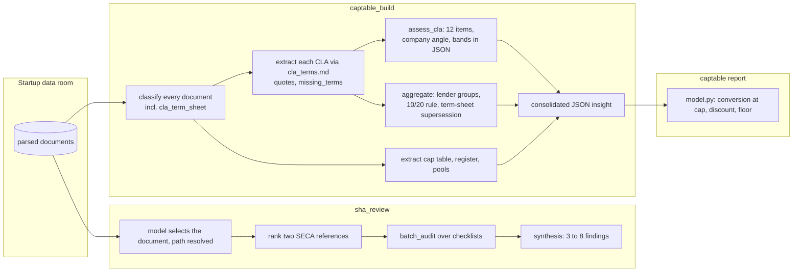
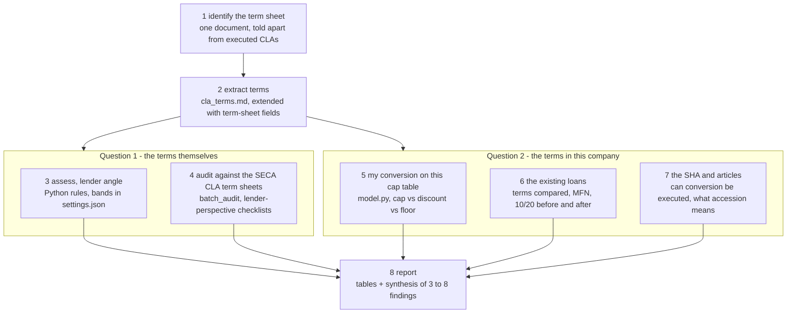

# CLA term sheet review — design

Status: proposal for discussion (Enrico, Lucas and Manfred). Companion to issue #__. This document explains how the existing pieces work together and how the new skill sits on top of them. It is written to give an overview for readers over the whole toolkit. Scope: the term sheet of a convertible loan. A priced-round term sheet is a possible later extension on the same skeleton and is not covered here.

## 1. The problem in one paragraph

Before SICTIC members lend, they receive the term sheet of a convertible loan: two to six pages that fix the loan amount, interest, maturity, the conversion events with cap, discount and denominator, and the process terms. Usually it follows the SECA CLA model documentation, short or long form. The members' question is not "is this a well-drafted company document" but "is this instrument safe and fair for me as a lender, and what does it do in this particular company". Today the toolkit classifies such a document as `cla_term_sheet`, extracts its terms as part of a whole-data-room cap-table build, and judges them from the company's market-standard angle. Nothing looks at one term sheet, from the lender's side, in the context of this cap table, these existing loans and this SHA. The new skill `cla_review` does that.

## 2. Two questions, not one

**Question 1 — Are the terms themselves acceptable for a lender?** Judged against the two SECA CLA model term sheets (short form and long form, February 2025, with their drafting notes) and the Swiss Angel Investor Handbook, chapter 8.3 on convertible notes and 8.4 on the 10/20/100 non-bank rules. This question can be answered from the term sheet alone.

**Question 2 — What do these terms do in this company, and to me?** Judged in context: the cap table (what my loan converts into at cap and at discount, and how the existing loans dilute me too), the outstanding CLAs (do my terms match or trail theirs, does an MFN clause exist anywhere, how many lenders does the company have and where do the non-bank rules land once N members join), and the SHA and articles (can the conversion actually be executed: consents, conditional capital or capital band, pre-emption waivers, what accession commits me to).

Both questions end in the same report, and both start from the same extraction of the term sheet.

## 3. What exists today, and what each part contributes

**`captable_build` already extracts and assesses CLA term sheets.** Classification knows `cla_term_sheet` (draft, unsigned, or term sheet). Extraction is per document and driven by the team-editable checklist `config/captable_build/cla_terms.md`: 40 fields today, each with a verbatim quote, absent clauses forced into `missing_terms`. A term sheet gets status `term_sheet` and is kept out of the outstanding totals. `assess_cla` judges 12 items (discount, cap, interest, maturity, QEFR trigger, conversion capital, denominator, MFN, pro-rata, subordination, change of control, SHA accession) against bands in `assessment_rules.json`, from the company's "market standard" angle. Aggregation groups lenders on identical terms for the 10/20 non-bank rules and matches term sheets against executed loans. For the new skill this is the whole of "what does the term sheet say", already built.

**`captable` already computes conversions.** `lib/captable/model.py` converts a note at cap, discount or floor under three round methods, with day-count interest accrual and stamp duty. For the new skill this is "what would I get", run for the member's own ticket instead of the company's loan stack.

**`sha_review` supplies the review pattern.** Model-selected document, path resolved only for that candidate; two SECA references ranked; `lib.batch_audit` over checklists with the full document and the reference in the cacheable prefix; synthesis. For the new skill this is the lender-perspective judgment layer, with the two SECA CLA term sheets as references.

**Shared foundations.** `InsightFile` owns every artifact: naming, manual precedence, freshness by source revision and configuration key. `generate_json` with a reviewer is the only way the model returns structured data.

## 4. The new skill

**1. Identify.** One term sheet is under review. Default: the model selects the most recent CLA term sheet in the data room with three retrieval queries, the code resolves that path only, and executed loans are excluded as candidates because they are context, not subject. Optional `--document` names the file directly, for the common case where the deal lead knows which draft the members are about to sign. Classification results from `captable_build`, when present, seed the candidates.

**2. Extract.** `extract_cla` as it exists, over `cla_terms.md` extended with the fields a term sheet carries and a loan agreement does not: aggregate investment amount and range, lead investor and accession of further investors, reduction subject to existing shareholders' pre-emption rights, conversion share class, non-qualified-financing voluntary conversion, conditions precedent, representations and covenants (long form), list of binding provisions, documentation counsel. Adding fields is safe by design; the guarded fields stay untouched. Every value carries a verbatim quote, and absence is a recorded claim.

### Question 1: the terms themselves

**3. Assess, lender angle.** `assess_cla` runs as today and its 12 findings are kept. A second rule set in Python, thresholds in `config/cla_review/settings.json`, judges the same fields from the lender's side, encoding the SECA drafting notes and the handbook:

| Term | What a lender wants (SECA notes, handbook 8.3) | Flagged |
|---|---|---|
| Valuation cap | present; the note calls it "often requested by investors" | absent with discount only, so the conversion price is unbounded |
| Denominator | fully diluted is "more investor-friendly" per the SECA note | issued and outstanding, or unstated |
| Discount | correlates with term; schedule that rises over time is fine | below band, or a high discount that also applies to a round closed within weeks |
| Qualified-financing threshold | high enough to exclude tiny rounds, low enough to be reachable | missing, or set where insiders can trigger or avoid conversion; compare with the company's stated raise |
| Maturity conversion | present with a stated price or fair-market mechanism; the SECA note says the cap is "rarely accepted" here | absent, so an unconverted loan at maturity is only a subordinated claim |
| Interest | stated, with day count; safe-harbor cap noted where insiders lend | unstated, or above the safe-harbor rate with insiders lending |
| Subordination | subordinated and unsecured, as the note expects; scope stated | non-subordinated is a legal-advice flag; scope unclear |
| Change of control | mandatory conversion or repayment with a multiple | absent |
| Lender majority and consents | who decides waivers and extensions | undefined |
| Binding provisions | limited to confidentiality, costs, effect, law | economic terms declared binding, or exclusivity |
| Documentation | SECA CLA short or long form referenced | bespoke or unnamed |

The bands are marked "to verify" until confirmed (Enrico, Luc?), as `assessment_rules.json` does today.

Proposed first set of lender-angle bands for `config/cla_review/settings.json`. Every value is a proposal to verify; sources are named where they exist, placeholders are marked as such.

| Parameter | Proposed default | Source | Status |
|---|---|---|---|
| Discount, minimum a lender should expect | 15% | Handbook: 15 to 25% most common for angels; SECA band 5 to 30% | to verify |
| Discount, schedule expected when term exceeds | 12 months | SECA note: discount correlates with term, rising schedule advised | placeholder |
| Valuation cap | required | SECA note: often requested by investors; without it the price is unbounded | rule, no number |
| Denominator | fully diluted | SECA note: fully diluted is the investor-friendly choice | rule, no number |
| Qualified-financing threshold, minimum | 1x the aggregate loan amount | SECA note: not too low, or a tiny round converts the loans | placeholder |
| Qualified-financing threshold, maximum | 3x the company's stated next-round target | SECA note: not too high, or the company can avoid conversion | placeholder |
| Maturity conversion | mechanism and price required | SECA note: cap rarely accepted here, fixed valuation or fair market value used | rule, no number |
| Term, maximum | 24 months | SECA note: bridge until the next round; number is a placeholder | placeholder |
| Interest above safe harbor with insiders lending | ESTV rate of the year | SECA note and handbook 8.3; published yearly by the tax administration | needs the current figure, dated setting |
| Change-of-control repayment multiple, minimum | 1x | SECA short form: conversion or repayment on change of control | placeholder |
| Lender majority for waivers and extensions | defined, at least two thirds of principal | earlier cla_review sketch | placeholder |
| Exclusivity | flagged when present | Handbook: not recommended for angel rounds | rule, no number |
| Legal fees | each party bears its own | SECA short form wording | rule, no number |
| Non-bank rules | 10 lenders on identical terms, 20 lenders in total | Handbook 8.4, fixed by law | fixed |
| Member count N for the before-and-after | 5 | SICTIC syndicate practice; placeholder | placeholder |
| Valuation range for the conversion table | 0.5x to 3x the cap | for the cap-versus-discount crossover | placeholder |

Rows marked "rule, no number" are switches rather than bands; they live in the same file so they can be turned off. The non-bank thresholds are the only fixed values. The safe-harbor rate changes every year and belongs in a dated setting, not in code.

**4. Audit against the SECA CLA term sheets.** sha_review pattern: rank the SECA short form and long form and run `lib.batch_audit` over checklists written from the lender's perspective, seeded from the earlier sketch: cap and discount interplay, maturity mechanism and price, conversion via consents versus conditional capital and who can block, QEFR realism, lender-majority definition, information rights, pro-rata and MFN, interest versus safe harbor, subordination scope, change-of-control multiple, stamp-duty position on conversion, syndicate or pooling vehicle, execution evidence. The audits cover what bands cannot: wording, consistency, and what the term sheet promises the definitive agreement will contain.

### Question 2: the terms in this company

**5. My conversion on this cap table.** From the consolidated `captable_build` insight and `model.py`, for the member's own ticket (an amount given on the command line, default the term sheet's minimum): shares and ownership on conversion at the cap, at the discount and at the floor for a range of next-round pre-money valuations, the price at which cap and discount cross, the effect of interest accrued to an assumed conversion date, ownership after the existing loans convert alongside, and stamp duty on conversion. If no snapshot exists the step yields an insufficient-evidence finding, not a failure.

**6. The existing loans.** Every outstanding CLA in the insight is compared with the term sheet: cap, discount, denominator, maturity, interest, subordination side by side; whether an MFN clause in any existing loan pulls the term sheet's terms into it or vice versa; whether the term sheet would join an identical-terms group; and the SICTIC-specific number, the lender count and the largest identical-terms group with and without N members joining on these terms, against the 10 and 20 thresholds of the non-bank rules, reusing the aggregation code. Maturities are listed together so a cluster is visible.

**7. The SHA and articles.** Whether the conversion can be executed as the term sheet assumes: conditional capital or a capital band on the register, or shareholder consents referenced, and whether those consents are documented; whether existing shareholders' pre-emption rights would reduce the members' allocation, as the SECA note warns; which share class the loan converts into and what rights that class has under the SHA; what SHA accession commits the lender to; whether the existing SHA restricts new loans or requires an investor consent for them. Without an SHA the review says so and treats accession terms as an open point.

**8. Report.** Deterministic tables (terms with quotes, absent clauses, company-angle and lender-angle assessments, my conversion table, existing-loan comparison, 10/20 before and after, executability checklist) followed by a synthesis in the `sha_review` format: numbered findings with status, supporting checks, why it matters, recommended follow-up, closing with "not legal advice".

**Artifacts.** JSON insights `identification`, `extraction`, `assessment`, `conversion`, `loan-context`, `sha-context`, `audits/<checklist>` under `insights/cla-review/`, and one Markdown report `cla-review-<startup>-<document>-<model>.md` directly under `insights/`, one per reviewed document. Manual files take precedence, `--fresh` discards generated work, failures are never reused.

**Interfaces.** `cla_review(dataset_name, *, document=None, ticket=None, fresh=False) -> list[InsightFile]`; CLI `python -m skills.cla_review --startup <name> [--document <file>] [--ticket <amount>]`; harness `/cla_review <startup> [--document f] [--ticket n]`; registry `cla-review`, domain `startups`, soft dependency on `captable-build`.

## 5. Reference material

- SECA CLA Model Documentation, February 2025: term sheet short form and long form with drafting notes, to be converted to Markdown under `config/cla_review/reference_term_sheets/`, as the SHA references are. The long form adds conditions precedent, subscription mechanics, representations and covenants.
- Swiss Angel Investor Handbook, chapter 8.3 (convertible notes: cap, discount, interest, day count, conversion mechanics) and 8.4 (the 10/20/100 non-bank rules), both already behind the cap-table skill; chapter 7 on the cap table for the dilution reading.
- The repository's `docs/captable-design.md` ("Anatomy of a Swiss CLA") and `config/captable_build/cla_terms.md`, which is the extraction contract this skill extends.

## 6. Decisions that touch existing contracts

1. **Extend `cla_terms.md` rather than fork it.** The term-sheet-only fields are added to the shared checklist; `captable_build` extracts them too and ignores them. Alternative: a second checklist file for term sheets, which would duplicate 40 fields. Recommendation: extend.
2. **Lender-angle rules next to `assess_cla`.** New module in `lib/captable/` (or `lib/cla_review/`), same finding shape, separate settings file. `assess_cla` is not changed.
3. **Document-scoped entry point.** `--document` on a dataset-scoped skill is new. Alternative: always auto-identify. Recommendation: both, with `--document` optional. No entry point for a file outside the data room; the draft goes into the startup's `datasets/` folder and is synced, as every skill assumes.
4. **Ticket amount as an input.** `--ticket` is a user input that shapes the output; it goes into the configuration key so a different ticket produces a different insight. Recommendation: accept it, default to the term sheet's minimum or the aggregate amount divided by the expected member count from settings.
5. **Audit status scale.** Keep `unclear | too weak | balanced | too strong` from `sha_review`, read from the lender's side in the checklist wording.
6. **Dependency.** Soft on `captable-build`. Question 1 works without a snapshot; question 2 then reports insufficient evidence.

## 7. Slices

| Slice | Content | Model calls |
|---|---|---|
| 0 | This document upstream, both SECA CLA term sheets as Markdown references, the synthetic fixture extended with a Fixture Robotics AG CLA term sheet and `ground_truth.json` with planted absences, skill package with SKILL.md and all contract-test registrations, README row | none |
| 1 | Identify, extract with the extended checklist, lender-angle assessment, report (question 1 without audits) | yes |
| 2 | My conversion, existing-loan comparison, 10/20 before and after (question 2, deterministic part) | none |
| 3 | SHA and articles executability, reference ranking, lender-perspective checklists (Enrico), synthesis | yes |
| 4 | Recall eval on a filled SECA term sheet with deleted clauses, MCP tool, deep-dive links | yes |

## 8. Risks and known limits

- Absent-clause recall is the known failure mode; the presence-boolean and `missing_terms` contract exists for this, and the fixture must plant absences.
- The SECA term sheets are two-column PDFs; conversion splits clause names across lines. The per-fragment evidence check from PR #71 applies.
- Question 2 is only as good as the cap-table snapshot; a stale or failed build must surface as such, never as a silent zero.
- Bands need Enrico's and counsel's input and stay marked "to verify".
- Nothing here replaces legal review. The report states that.
